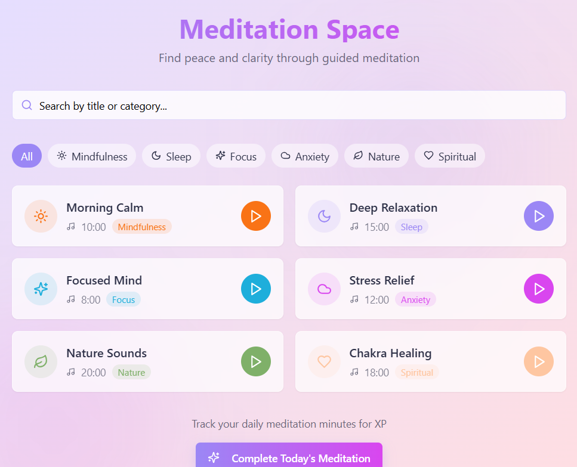

# Welcome to ANUVRUDDHI (Meaning =" Sustainable growth ")  by Anushka

Flourish with Nature. Rise with purpose.

## What technologies are used for this project?

This project is built with:

- Vite
- TypeScript
- React
- shadcn-ui
- Tailwind CSS

#  Anuvruddhi - Flourish with Nature. Rise with Purpose.
** Anuvruddhi ** is a gamified life-growth and eco-conscious app that empowers users to evolve mentally, emotionally, and spiritually through daily mindful actions - while giving back to the planet through tree planting, gratitude rituals, and soul-based tasks.

----

##    Project Vision 
Anuvruddhi is not just an app - it's a movement to help individuals grow menatally, emotionally, and spiritually while also connecting deeply with nature. Our mission is to inspire meaningful action, personal reflection, and real-world impact through a gamified self-evolution journey.

---

##    Core Objectives
-  Empower users to build healthy, mindful habits
-  Encourage environmental responsibility through tree-planting tasks
-  Reward growth with XP, certificates, and Sould Gems
-  Create a safe, encouraginng digital space for self-reflection and purpose.

  
## ** Key Features

- Firebase Authentication (Sign Up/ Login / Session Tracking)
- XP tracking, badge system, and certificate generation
- Tree planting tracker with task automation
- Telegram bot integration for milestone notifications
- Life Prediction and habit-based reward system
- Dynamic dark-blue UI with motivational theming
- AI-generated progress reflections and emotional insights

- ---
##   Tech Stack

- Lovable.dev
- Firebase Realtime Database
- Telegram Bot API
- Canva, Figma (UI)
- TypeScript, React (auto-generated by lovable)
- ---

##   Prompt Scripts

You can find my lovable prompt logic here:
- [Task Completion prompt](prompts/task_completion_prompt.txt)
- [Certificate Trigger Prompt](prompts/certificate_trigger_prompt.txt)
- [Sign In Flow Prompt](prompts/Sign_in_flow_prompt.txt)
- [Telegram Bot Setup Prompt](prompts/telegram_bot_setup.txt)
- [Telegram Webhook Setup prompt](prompts/telegram_webhook_setup.txt)
- [Age Prediction Prompt](prompts/age_prediction_prompt.txt)
- [Firebase Setup Prompt](prompts/firebase_setup_prompt.txt)
- [Self Avatar Creation Prompt](prompts/self_avatar_creation_prompt.txt)

  Add prompt file links to README

  ## Getting Started
     1.  Click the live App link above
     2.  Sign up with your email
     3.  complete a daily task
     4.  Watch your XP and avatar on Telegram
     5.  Share your milestone on Telegram

        ---
  ## Credits
     -  UI design: ** Anushka Sarode ** (First-year engineering student)
     -  Icons & visual assets : Canva, Figma
     -  Core Logic prompts : Written & executed in lovable
     -  Backend: Firebase
     -  Real-time rewards: Telegram Bot
      ----

** Sign up Page ** ** Your Daily Journey ** ** Wisdom Wheel of Fortune **
        ** Your Habit Garden **  ** Temple of You **  ** Meditation Space **   ** Exercise Hub **  ** Study Space **  ** My Growing Forest **   ** Certificates ** 
       --

## Additional Project Resources

  All supporting documents related to Anuvruddhi are available here:
        -  [A(project ppt).pptx](AdditionalResources/A(project_ppt).pptx)
        -  [B(task schedule).pptx](AdditionalResources/B(task_schedule).pptx)
        -  [C(Tools used).docx](AdditionalResources/C(Tools_used).docx)
        -  [D( git-hub link, app link, summary).docx](AdditionalResources/D(git-hub_link,_app_link,_summary).docx)

  Please refer to these files for a deeper understanding of the project planning, tools utilized, and execution timeline.
      ---
  ##     Developed by
     ** Anushka Sarode **
  First Year Engineering Student
  * National Hackathon Submission 2025 *

> Note: The live version is not shared publicly to protect the prototype.
> This project was built for the Life Quest Hackathon 2025 using a no-code platform.
> For a demo or pitch, feel free to reach out.
